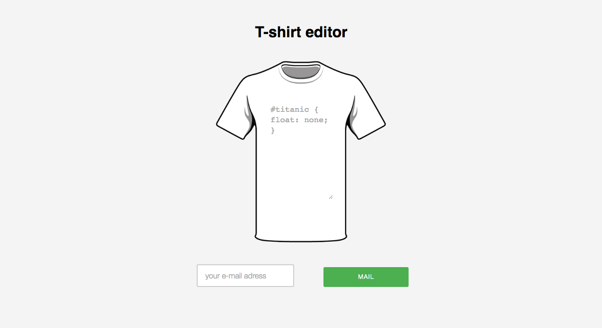
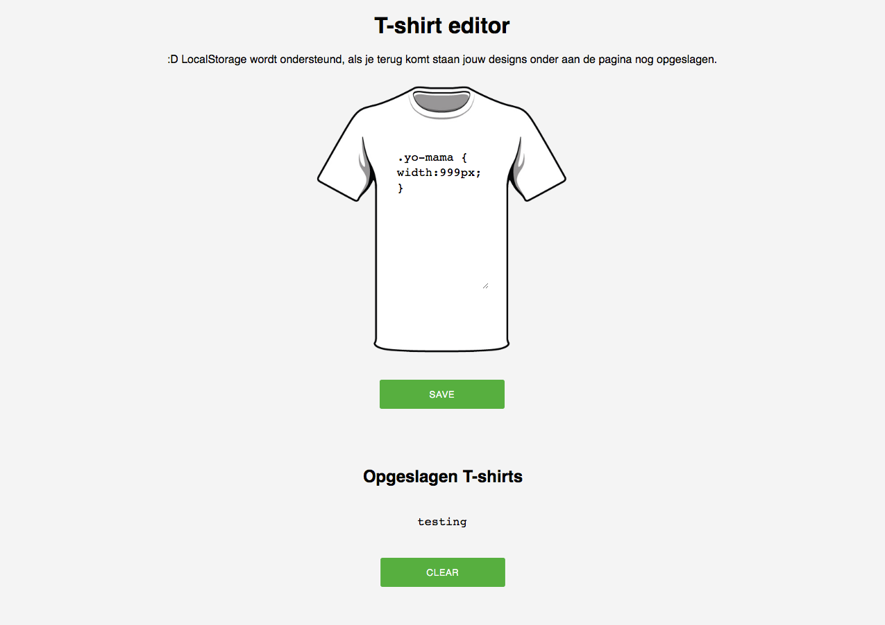
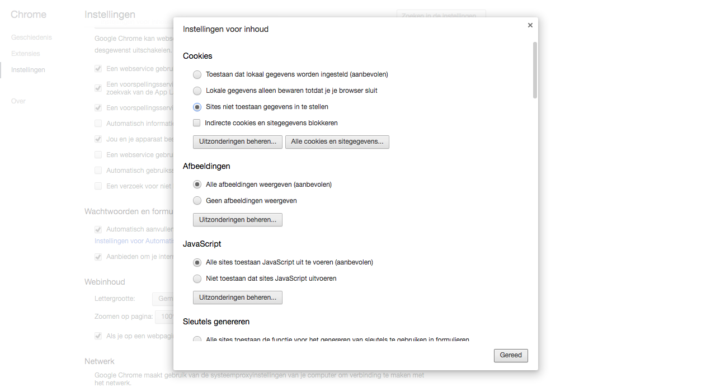

# Browser-Technologies

Demo: http://www.baskunst.nl/demo/

# Use cace

Ik wil favoriete t-shirts-met-nerdy-teksten kunnen opslaan, en een volgende keer dat ik de site bezoek kunnen gebruiken - Web storage

# Basis

Gebruikers van de applicatie kunnen zelf een tekst op een t-shirt zetten en 'opslaan' om later mee verder te gaan. De basis van de app is zo opgezet dat een gebruiker ten alletijde zijn of haar gemaakte t-shirt kan mailen naar zichzelf om later aan door te werken. Hiervoor maak ik gebruik van een simpel php formulier die de aangemaakte content doorstuurd aan de gebruiker.

	<h1>T-shirt editor</h1>

	<form name="myform" action="mail.php" method="POST">

		<textarea type=text name="name" placeholder="Pretty fly for a WIFI"></textarea>
		<input type="text" placeholder="your e-mail adress" name="to" size="25" />
		<input type="submit" value="Mail"/>

	</form>

# Css

# Enhancement

De enhanced versie van de applicatie maakt gebruik van localStorage om de t-shirts op te slaan in een tabel onder aan de editor.

### Feature detection

Er zijn meerdere manieren om te kijken of jouw browser localStorage ondersteund. Zo kun je gebruik maken van externe library's als zoals Modernizr om dit te checken. Ik maak echter voor deze demo gebruik van de standaard API.

	function CheckBrowser() {
		if ('localStorage' in window && window['localStorage'] !== null) {
	        // we can use localStorage object to store data
	        return true;
	    } else {
	             return false;
	    }
	}  

Als de CheckBrowser functie 'true' is maken we dynamisch een table aan om de t-shirts in op te slaan.

	for (i = 0; i <= localStorage.length - 1; i++) {
        key = localStorage.key(i);
        list += "<tr><td>" + key + "</td>\n<td>"
                + localStorage.getItem(key) + "</td></tr>\n";
    }

We voegen de tabel toe aan onze html.
	
	
	
		<h2>Opgeslagen T-shirts</h2>		
		<table id="list"></table>
		<input type=button value="Clear" class="btn" onclick="ClearAll()">
	

We voegen een 'Save' functie en 'Clear' funtie toe aan het script.

	function SaveItem() {		
		var name = document.forms.myform.name.value;
		var data = document.forms.myform.data.value;
		localStorage.setItem(name, data);
		doShowAll();
	}

	function ClearAll() {
		localStorage.clear();
		doShowAll();
	}

En we verbergen de mail fonctionaliteiten op het moment dat localStorage wordt ondersteund.

	mail.className += " hidden";
	mail_btn.className += " hidden";

### Result	

# How to disable localStorage in browser (Chrome)

Je kunt in Chrome bij je instellingen sites niet laten toestaan gegevens in te stellen.

## Alternative

Hoewel de demo werkt zoals ik dit voor ogen had zijn er andere oplossingen om met dit probleem om te gaan. Ik heb daarom in eerste instantie een demo proberen te maken die in de basis de shirts serverside wegschrijft in een database en bij later bezoek weer ophaald. Echter hoewel ik veel van de stappen die je hiervoor moet doorlopen wel begrijp moet ik concluderen dat deze oplossing een beetje boven mijn programeer skills ligt.

